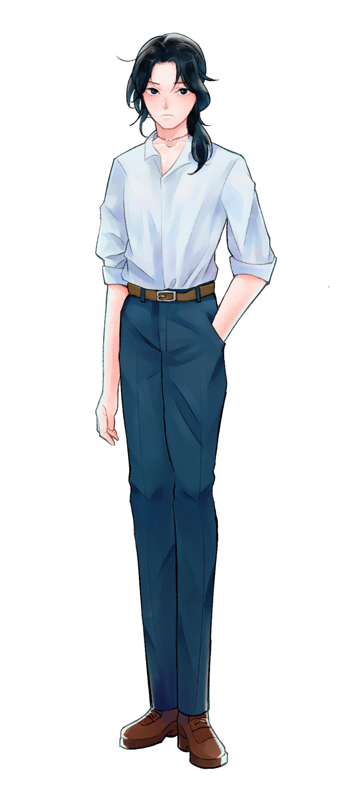

# 范柏舟｜角色介紹

范柏舟

PTⅢ(2020/10-2020/12)

人設(P&T期間)

姓名：范柏舟
生日：10月27日
年齡：28(參與企劃當下)
性別：男
身高：174
家人：兄

✦簡介

目前為警局機動組人員，黑髮，眼睛在強光下可以隱約看見偏藍，但平時看起來就是黑色。

國中升高中時父母失事，和兄長相依為命，十分乖巧，當時就讀大學的兄長雖然搬回家中居住，但作為生物工程學系學業忙碌，難免疏於照顧。兄長由於工作的緣故在柏舟成年後搬到瑞士。

就讀警大資訊科，面無表情的時候看起來像在生氣，有時是在發呆但有時候也是真的在發脾氣，很拘謹，討厭咖啡，思考的時候會摩娑中指上的痣。

17歲結識Isaac，交往5年，後Isaac無預警消失。

繪師：@amber33(Plurk)

✦NPC

哥哥：范庭燎
├醫療器材工程師(O氏)
└？

EX：Isaac
└詳見Isaac頁面

✦無關緊要的細節

◇認為自己有皮膚飢餓的傾向，希望被觸碰但覺得自己這樣很有毛病

◇清醒的時候肌膚相親會很害羞，摸摸人家小手就覺得好像在自我滿足吃人家豆腐，雖然這個飢渴感沒有被自己的諮詢師認證
